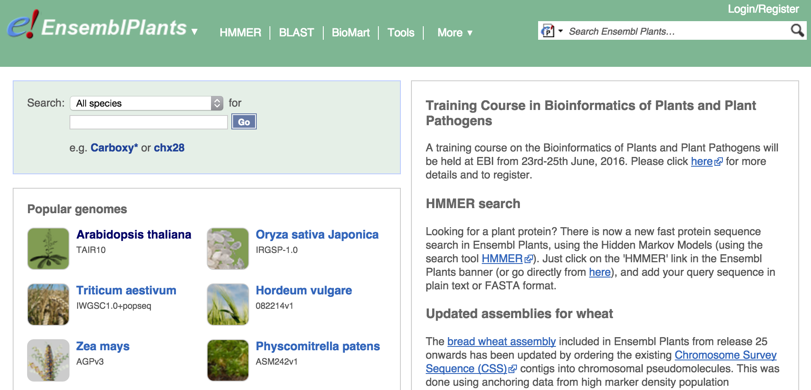
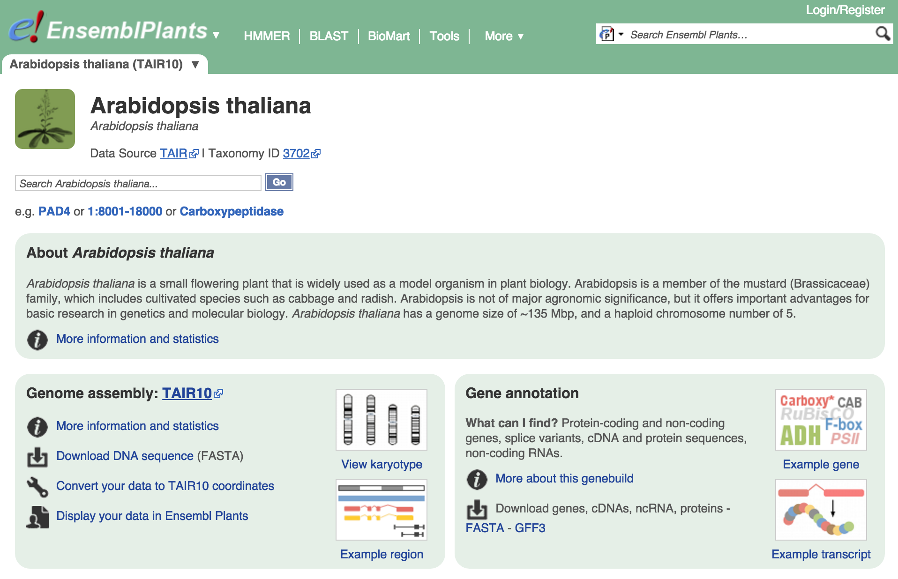
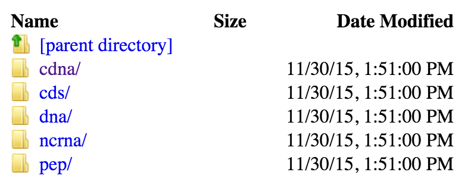
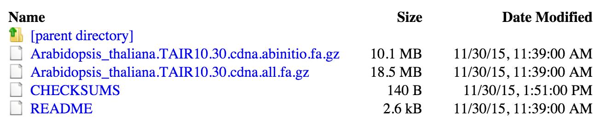

### Quantifying expression - overview

Expression quantification involves comparing the sequenced reads to known transcript sequences. We therefore will need to download both the read data and a suitable set of reference transcripts.

### Choosing a reference

In the case of arabidopsis there is only one genome assembly project that provides the standard reference sequences (although competing projects are now underway). The TAIR resource provides genome assemblies and annotations for arabidopsis. The current version of TAIR is TAIR10 - we want the cDNA sequences from this annotation.

We will get this data from Ensembl Plants (http://plants.ensembl.org/index.html), which is a high-quality resource for plant genomics, providing reference sequences, annotation, functional information and population and comparative genomics information.

> **NOTE** - the next few instructions cover how to download the data from Ensembl. You can do this if you'd like, but if your internet connection is slow you can use the pre-downloaded reference file in the `./data` directory. Skip to the next section to see how to use it.

Arabidopsis is so important to plant science that it's the first species highlighted on the Ensembl Plants homepage!



If you click through to the Arabidopsis page you have a lot of different data types available to download.



We're looking for reference transcript sequences, which are under the **Gene annotation** section. Click the **FASTA** link to go to the Ensembl Plants FTP server where the data can be downloaded.



We want **cDNA**, which is a DNA representation of mRNA, and within the cDNA directory we want the `Arabidopsis_thaliana.TAIR10.30.cdna.all.fa.gz` file.



### Preparing the reference

The reference file should be saved in `./data/reference/`. Check by running the following command in your terminal:

```bash
ls data/reference
```

If the file isn't already there, move it there now.

The file is a FASTA file that has been [gzipped](https://en.wikipedia.org/wiki/Gzip), meaning it has been compressed in a format similar to a .zip file.

We need to extract the FASTA file from the archive before we can work with it. To do that, run:

```bash
cd data/reference
gunzip --force Arabidopsis_thaliana.TAIR10.30.cdna.all.fa.gz
cd ../..
```

### Getting the reads

The experiment we'll be replicating has 9 read files - one for each sample (3 replicates and 3 conditions). For this tutorial we'll only actually process one of the read files to save time - precomputed quantification results are provided for the later steps. But we'll also see how to get and process all the data, so you'll be ready to do so with your own data in the future.

The European Nucleotide Archive provides reads in gzipped FASTQ format on an FTP server. There are a lot of options for downloading these kind of files, but we'll use one of the simplest: `wget`.

To download any file with wget, you just run:

```bash
wget URL
```

... where `URL` is the URL of the file to download. It will be downloaded with a progress bar and saved to the current working directory.

**This file is already downloaded for you! You can find it in `./data/reads/SRR3136731.fastq.gz`**. For future reference, if you wanted to download the first read file from this experiment you would...

```bash
cd data/reads
wget ftp.sra.ebi.ac.uk/vol1/fastq/SRR313/001/SRR3136731/SRR3136731.fastq.gz
cd ../..
```

Unlike the FASTA transcript file we downloaded, we don't need to `gunzip` this one. That's because we'll use a clever trick to do this on the fly as we run Salmon, the tool we're using for quantifying expression.

### Installing Salmon

Salmon is a very fast, very accurate tool for quantifying transcript expression using RNA-seq data.

Here we'll go over the process for downloading and installing Salmon, because it's a very useful skill to have in bioinformatics.

Salmon, like many tools, provides a precompiled binary distribution. This means we can just download it, unpack it and run it. This is much quicker than the alternative which is to download the source code and compile it from scratch.

Normally we'd browse to the [Salmon website or Github repository](https://github.com/COMBINE-lab/salmon), and then look at the releases tab. From there we'd pick the latest release and then choose the binary download that matched our system (in this case, Linux x64).

The download link for version `0.6.0` is:

```
https://github.com/COMBINE-lab/salmon/releases/download/v0.6.0/SalmonBeta-0.6.0_DebianSqueeze.tar.gz
```

**The file is already downloaded for you** (in case of internet outage) - you can find it at `./software/SalmonBeta-0.6.0_DebianSqueeze.tar.gz`.

To get it ready to use we need to do the following:

- extract the `.tar.gz` file
- add its `bin` directory to the `$PATH`, or move it somewhere that it can be run easily from


So...

```bash
cd software
tar xf SalmonBeta-0.6.0_DebianSqueeze.tar.gz
mv SalmonBeta-0.6.1_DebianSqueeze/* .
rmdir SalmonBeta-0.6.1_DebianSqueeze
cd ..
```

You should check that you can run Salmon by running:

```bash
./software/bin/salmon --help
```

You should see something like...

```
Allowed Options:
  -v [ --version ]      print version string
  --no-version-check    don't check with the server to see if this is the
                        latest version
  -h [ --help ]         produce help message

    Salmon v0.6.0
    ===============

    Please invoke salmon with one of the following commands {index, quant, swim}.
    For more information on the options for these particular methods, use the -h
    flag along with the method name.  For example:

    salmon index -h

    will give you detailed help information about the index command.

```

### Indexing the reference

Before the quantification can be run, Salmon first needs to index the reference transcriptome. In this step, Salmon creates an efficient data structure that allows very fast determination of candidate transcripts where each read might originate.

To create the index, run:

```bash
./software/bin/salmon index \
  --transcripts ./data/reference/Arabidopsis_thaliana.TAIR10.30.cdna.all.fa \
  --index ./data/index \
  --type quasi \
  -k 31
```

Here's what we just told Salmon to do:

- `salmon index` -- run the indexing step
- `--transcripts` -- where to find the input transcript FASTA file
- `--index` -- where to put the output index directory
- `--type quasi` -- use the quasi-mapping algorithm
- `-k 31` -- use a word size of 31 bases in the index

You should now see that Salmon has created an index directory at `./data/index`

### Quantifying expression

Now we will perform the quantification step. It takes the reads and the transcript sequences as input, and outputs a table containing expression estimate information for each transcript in the reference.

The quantification must be run separately for each sample, and it produces a separate output directory for each sample.

Later we will see how to combine the information from all samples.

To run Salmon, we will use a bash script. Create a new file in `./scripts` called `run_salmon.sh`.

```bash
mkdir scripts
nano scripts/run_salmon.sh
```

Copy and paste the following into the script:

```
SAMPLES=(SRR3136731)

for id in ${SAMPLES[@]}; do
  ./software/bin/salmon quant \
    -p 6 \
    -i ./data/index \
    -l U \
    -r <(gunzip -c ./data/reads/${id}.fastq.gz) \
    -o ./data/salmon/quant_${id}
done
```

Now save the file (`ctrl o`) and exit (`ctrl x`).

This code runs Salmon for each sample in a list of samples. This might look alien to you, so let's break it down:

- `SAMPLES=(SRR3136731)` - make a bash variable containing an array, and put a single identifier in the array. If we were analysing more samples we would list them all here, separated by spaces. e.g.: `SAMPLES=(SRR3136731 SRR3136732 SRR3136733 SRR3136734 SRR3136735 SRR3136736 SRR3136737 SRR3136738 SRR3136739)
`
- `for id in ${SAMPLES[@]}; do` loop over the sample identifiers, making `id` refer to the current identifier inside the loop
- `./bin/salmon quant \` run Salmon's `quant` step. The ` \` tells bash that the command continues on the next line.
- `-p 6` use 6 threads
- `-i ./data/index` where to find the index
- `-l U` tells Salmon these are unpaired reads
- `-r <(gunzip -c ./data/reads/${id}.fastq.gz)` use these unpaired reads. `<(command)` runs a command in a separate process and sends the output as an input stream to Salmon - in this case we use it to `gunzip` the reads on the fly. `${id}` inserts the sample identifier currently being processed into the command.
- `-o ./data/salmon/quant_${id}` where to write out the results

Phew!

Now, we **run the script we just made**:

```bash
bash scripts/run_salmon.sh
```

Ok, Salmon should have run, and printed some progress messages to the screen.

The messages may have warned you that the strand orientation of the reads was unbalanced. Salmon expects us to tell it about stranded sequencing, but in this case we didn't. It has detected that the reads were stranded and warned us - but in this case we don't care because we aren't using the strandedness information.

### Inspecting the results

Congratulations! You've just quantified expression from RNA-seq data.

Before you move on to analysing the data, you should take a look at it from the command-line to see if it seems to have worked OK.

```bash
# look at the list of files
ls ./data/salmon/quant*
# look at the first 10 lines of the results table for the first sample
head ./data/salmon/quant_SRR3136731/quant.sf
```

You should see something like...

```
Name	Length	EffectiveLength	TPM	NumReads
ATMG00010.1	462	261.577	0.203453	1
ATMG00030.1	324	125.61	59.3157	140
ATMG00040.1	948	747.567	0	0
ATMG00050.1	396	195.748	0.271874	1
ATMG00060.1	542	341.567	0.311615	2
ATMG00070.1	573	372.567	1.99981	14
ATMG00080.1	540	339.567	1.2538	8
ATMG00090.1	1671	1470.57	0.470461	13
ATMG00110.1	621	420.567	0.253081	2
```

This is the first ten lines of the expression quantification result table for this sample. It contains five columns:

- `Name` - the name of the transcript
- `Length` - the length of the transcript in bases
- `EffectiveLength` - the number of possible start sites in a transcript that could have generated a fragment
- `TPM` - **t**ranscripts **p**er **m**illion - if there were a million transcripts, how many would be copies of this transcript?
- `NumReads` - the number of reads assigned to this transcript

Now you're ready to merge the result data.
