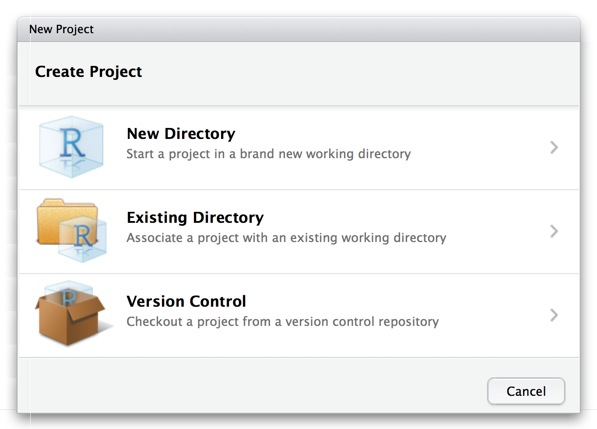

### Preparing expression quantification data for analysis

So far we've performed expression quantification for a single sample using Salmon. You've also been provided with the output for the other samples.

At the moment the output for each sample is in a separate directory. Also, the samples are named according to their ENA ID rather than their condition and replicate. We will solve both of these problems now.

From this point onward we will be using RStudio. Open RStudio now.

### Creating a project

It's important that we keep our files clearly organised so we can find them later. We'll do this using an RStudio project.

Select `File > New Project...` from the menu.



Next, choose `Existing Directory`, and then select the `RNA` directory on the desktop.

### Obtaining the metadata

We will need some metadata about the experiment in this step.

Open a terminal and run:

```
cd ~/Desktop/RNA/data
mkdir -p metadata
cd metadata
wget http://www.ebi.ac.uk/arrayexpress/files/E-GEOD-77428/E-GEOD-77428.sdrf.txt
```

### Perparing the data

An R script is provided at `./analysis/01_merge_data.R`. It:

- loads the expression data and the experiment metadata
- reorganises the expression data into one table per data type
- labels the columns meaningfully (by condition and replicate)
- saves the new data tables to a new directory `./data/merged`

Open the script `./analysis/01_merge_data.R` in your RStudio. The easiest way to do this is to look at the `Files` tab in the bottom-right pane, and then click the `analysis` directory, followed by the `01_merge_data.R` script.

**Read through the script comments and code**. Execute the code one piece at a time, making sure each piece runs successfully and thinking about what it does.

When you've finished go to the terminal and run:

```bash
cd ~/Desktop/RNA
ls ./data/merged
```

You should see three new files: `tpm.csv`, `est_counts.csv` and `eff_length.csv`. These are the files we will use in the next step.
